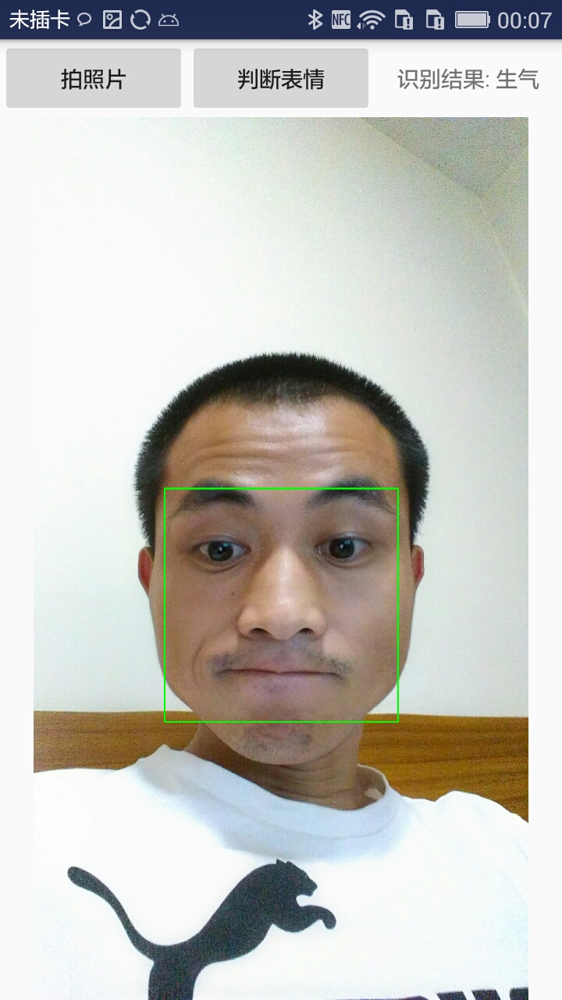
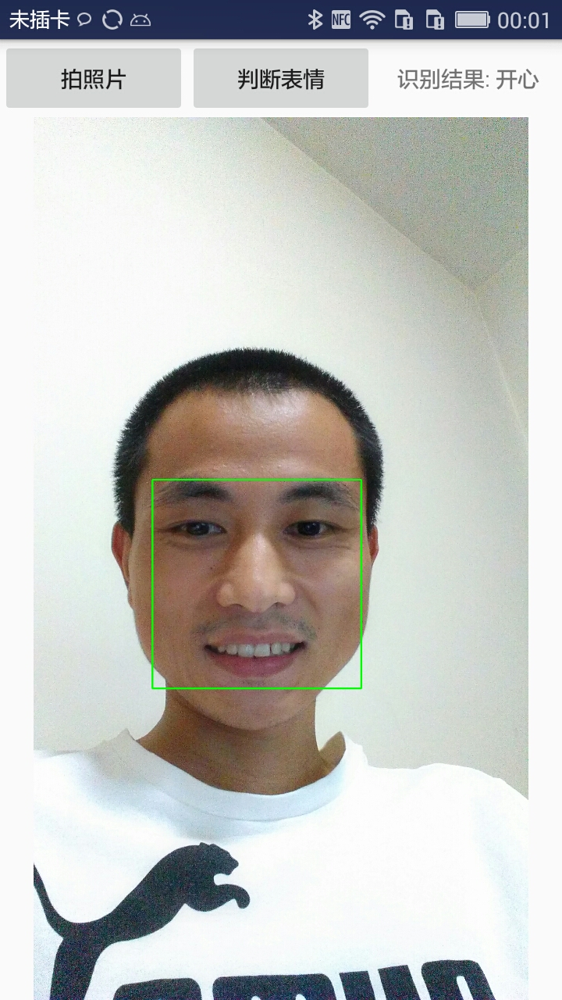
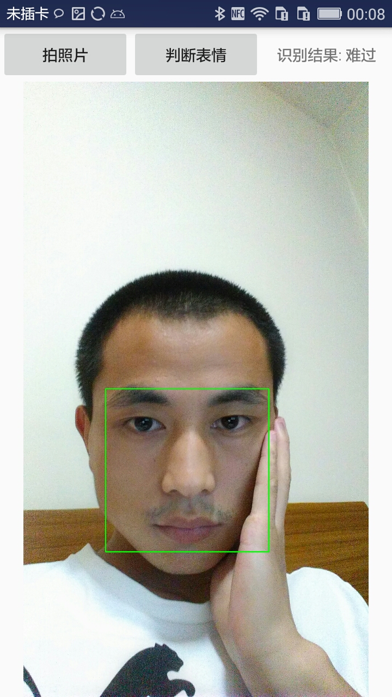

## 1、项目简介

基于卷积神经网络的实现Android人脸表情识别APP，主要功能为：通过手机摄像头拍摄照片后对人脸表情进行识别。觉得不错或有点帮助的麻烦给个星，^_^。

Android APP地址：https://pan.baidu.com/s/1M8UZSvBlKfJc7ykJB_HhYA

Android_FacialExpressionRecognition项目下包含两块代码：
### 1.1. Tensorflow:
PC端处理数据及训练CNN模型代码，编程语言为python，运行cnn_tensorflow.py即可进行模型训练并保存PB文件，该模型通过3个卷积池化层后叠加3个全连接层。
Android_FacialExpressionRecognition\Android_FacialExpressionRecognition\Android\Android_FacialExpressionRecognition\app\src\main\assets\FacialExpressionReg.pb中为epoch=150训练得到的模型，在fer2013数据集中大约有70%准确率。

该模型输入为2304维的向量，48*48*1的单通道图片，输出结果为0~6（0=Angry, 1=Disgust, 2=Fear, 3=Happy, 4=Sad, 5=Surprise, 6=Neutral）。

训练集来源于https://www.kaggle.com/c/challenges-in-representation-learning-facial-expression-recognition-challenge/data 
，fer2013.csv文件稍后我会将它放在百度云。运行gen_record.py可以将训练集fer2013.csv还原为图片，主要是看看图片效果。

数据集地址：https://pan.baidu.com/s/1zGW5kkzncNCq_EE6wv5WBw

### 1.2. Android:
通过摄像头拍摄图片后，用opencv cascadeClassifier进行人脸检测并对检测到人脸的部分进行灰度处理并缩放成48*48*1向量，

### 1.3.开发环境：

PC端：python3.6, TensorFlow-gpu1.6, 硬件NVIDIA GTX1050ti, 4GB momery.

APP端：Android studio3.1.2, TensorFlow Lite, opencv-3.4.2-android-sdk

## 2、APP运行结果

### 2.1、生气

### 2.2、厌恶

### 2.3、开心

### 2.4、难过

###实在是没有那么多表情了...可以自己试试

## 3、遇到的一些问题

### 3.1、Android Bitmap.getPixel获取的像素值为负，导致模型输出结果不正确。
Android Bitmap为像素值为ARGB，需要处理下。

### 3.2、Android拍摄的照片默认是横屏，在处理神经网络预测的数据前需要旋转图片270度。
可以将预测前的数据写入文件后，添加到fer2013.csv数据集，用gen_record.py脚本生成图片看看效果。可以自己增加数据集。

### 3.3、APP预测表情时Tensorflow报错：cannot use java.nio.IntArrayBuffer with Tensor of type INT64。
需要在Tensorflow下将输出类型改为int32。

### 3.4、APP预测表情时Tensorflow报错：cannot use java.nio.IntArrayBuffer with Tensor of type INT64。
需要在Tensorflow下将输出类型改为int32。

### 3.5、Tensorflow CNN模型中定义的变量名需要和Android中使用PB文件时传入传出的变量名一致。

## 4、TODO

1.目前APP有90M左右，需要对神经网络模型进行压缩，减小APP大小。

2.目前训练集28700个样本，测试集大约7000个样本。可以在网上抓取一些训练样本，用data augmentation方法对数据进行扩充。

## Tips:

如果Github下载速度很慢，参考https://blog.csdn.net/qq924795111/article/details/80799704 进行配置